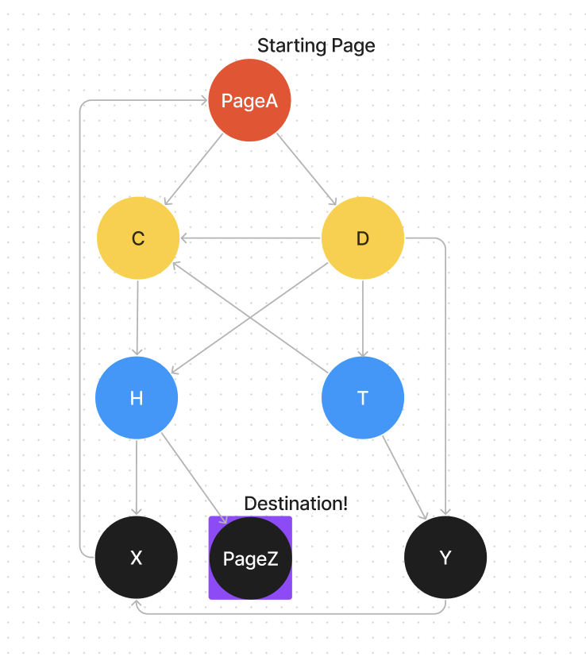
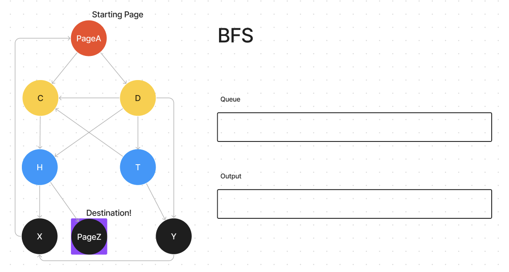
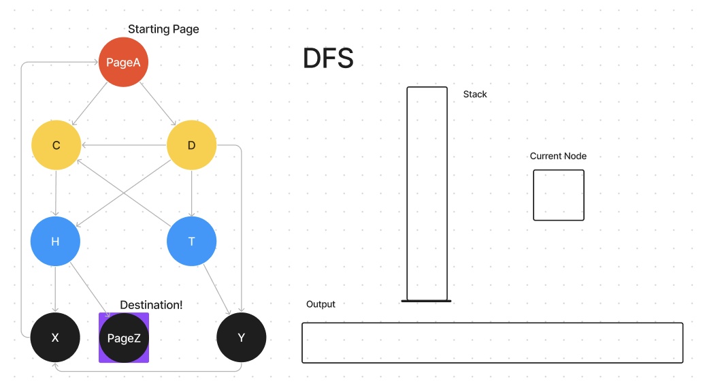

# BFS with Queues & DFS with Stacks

## Teacher Notes

### Goal & Sequence

Students will synthesize their understanding of trees, stacks, and queues to learn the Breadth First Search and Depth First Search algorithms. The game "Six Degrees of Wikipedia" will be used as the codeless activity so that students can start formulating pseudo code strategies, and the walkthrough will use pre-written pseudo code and graphs to demo the algorithms.

The Coding Activities are optional but give students an opportunity to implement the algorithms with a partner. 

- [Launch](#launch)
- [Lesson Walkthrough](#lesson-walkthrough)
- [Extensions](#extensions)
- [Close](#close)

### Teaching Tips

Queues and Stacks are required prerequisites for this lesson. For the coding portion, some familiarity with Trees or graphs is also required.

### Representation

_The Great British Bake Off_ and _Harry Potter_ were two arbitrary links that were included here. Feel empowered to change these or have student pairs choose their own two, not-connected Wikipedia pages.

### Learning Objectives

Students will be able to:

- Explain the BFS and DFS algorithm to a peer.
- Observe the relation between BFS and queues, and DFS and stacks.
- Articulate the differences between the BFS and DFS algorithms 
- Create and trace pseudo code through sketches and diagrams
- [Stretch] Write code for the BFS and DFS algorithm

## Launch

Have you heard of "Six Degrees of Wikipedia". It's when you try to get from one wikipedia page to another by only clicking links within the page your currently looking at. Try it! Try starting at [The Great British Bake Off](https://en.wikipedia.org/wiki/The_Great_British_Bake_Off), and click your way to [Harry Potter](https://en.wikipedia.org/wiki/Harry_Potter). [Click on this link](https://www.sixdegreesofwikipedia.com/?source=The%20Great%20British%20Bake%20Off&target=Harry%20Potter) to see the answer.

- What was your strategy going into this?
- If you were to write a computer program to do this for you, what strategy would you have it do?

Talk through your strategy using this (simplified) Wikipedia Link Graph. Start at **Page A** and find your way to **Page Z**.

## Lesson Walkthrough

**Breadth First Search with Queues**

Here are the steps to the Breadth First Search algorithm:
1. Pick a starting node and put it in the queue
2. Until the queue is empty...
    - Pop and print the next node from the queue, if it's the destination node, you're done!
    - Otherwise, add the node's children to the queue if they haven't already been added.

_Use the image below to test it out:_

**BFS Coding Activity**:

- Explain BFS with your partner in your own words.
- Then, work with them to write the code in the `main.py`

**Depth First Search with Stacks**

Here are the steps to the Depth First Search algorithm:
1. Set a current node to a starting node of your choice
2. Do these steps:
    1. If it's not printed already, print the current node
    2. If the current node is the destination node, you're done!
    3. Otherwise...
        - If it has unprinted children nodes
            - add the current node to the stack, and
            - make one of it's unprinted child nodes the current node.
        - Otherwise, pop the stack and make that node the current node.
3. If the stack is not empty Repeat #2

_Use the image below to test it out._

**DFS Coding Activity**:

- Explain DFS with your partner in your own words.
- Then, work with them to write the code in the `main.py`
- [Stretch] Start noticing the difference between BFS and DFS.

> **Note:** "unprinted" is formally called "unvisited". Typically this visited nodes are kept in a list.

## Close

- How does BFS differ from DFS?
- Which one worked better for the Wikipedia search?

## Extra Help & Resources

- [Video](https://www.youtube.com/watch?v=vf-cxgUXcMk) walking through the 2 algorithms.
- When you just want to visit every node, that's called traversing a tree. Here's some [extra reading](https://builtin.com/software-engineering-perspectives/tree-traversal) on that vocabulary.
