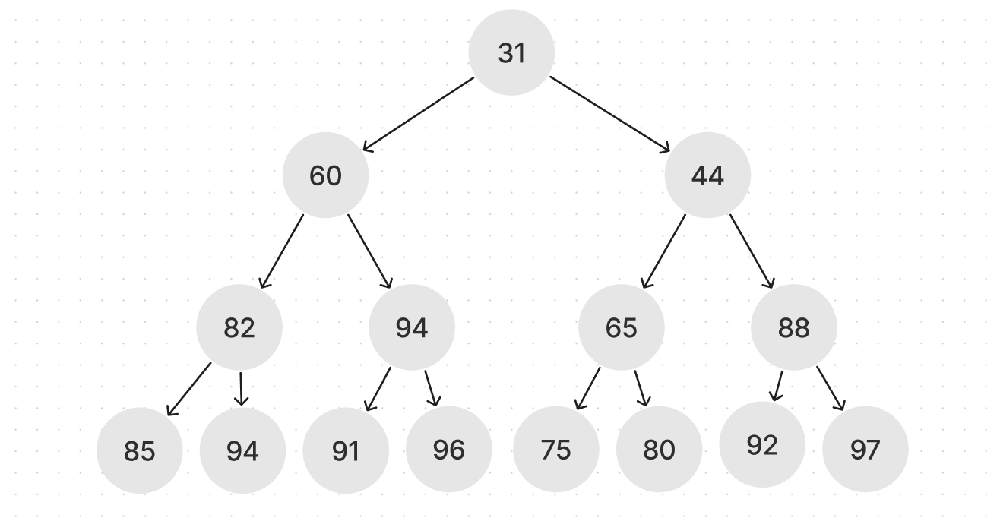

# Ancestry Tree

[](https://repl.it/github/upperlinecode/<INSERT_GITHUB_EXTENSION>)

## Contents

- [Intro](#intro)
- [The Lab](#the-lab)
- [Extensions](#extensions)
- [Hints & Resources](#hints--resources)

## Intro

According to genetic science, you are the product of the genes from your parents and their parents before you and so on. Luis just took a test and found out that he is 31% Hispanic. Culturally he is much more, but this made him curious dive into his roots and study his genetic tree a bit.

## The Lab

1. Here's a diagram of Luis's ancestry results. The numbers signify the percentage of genes that show Hispanic (eg. 31 => 31% Hispanic). For the diagram, assume **left is the biological mother and right is the biological father**. _For example, `level 1` is Luis, `level 2 node 1` is his mother, and `level 2 node 3` is his grandmother on his father's side, etc._

    

    
    - Which of Luis's parents are most Hispanic? Grandparent?
    - Which mother in the graph is the least hispanic? 

2. The code for this tree is set up as an Object. We can't see the whole thing, but we do have Luis's node.

    ```py
    class Hispanic():
        def __init__(self, percent):
            self.percent = percent
            self.mom = None
            self.dad = None

    luis = Hispanic(31)
    # ... code to set up whole tree

    print(luis.mom.percent)
    print(luis.dad.mom.percent)
    ```
    - Predict the outputs above.
    - Which search would you prefer to use if your looking for the percent of a great-grandparent? BFS or DFS?


## Extensions

_See the `main.py` for the challenges._

## Hints & Resources