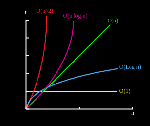

# Big O Time Complexity

[](https://repl.it/github/upperlinecode/<INSERT_GITHUB_EXTENSION>)

## Teacher Notes

### Goal & Sequence

The goal of this section is to have students start thinking about how fast or slow their specific solutions to problems can be and how to optimize for time efficiency. 

- [Launch](#launch)
- [Lesson Walkthrough](#lesson-walkthrough)
- [Extensions](#extensions)
- [Close](#close)

### Teaching Tips

Only prerequisite knowledge here is `lists`, `dictionaries`, `for loops`, and `binary search`. The lesson mostly avoids coding and focusses on reading code, looking for specific indicators. For hands on coding, refer to the lab. 

### Learning Objectives

Students will be able to:

- Use Big O notation to describe time efficiency
- Explain the relationship between specific syntax and how it effects Big O


## Launch

0. On binary search day, you learned that binary search was much better than linear search. On sorting day before that, you saw several ways to sort a list of numbers, and possibly had a chance to compare which were better and worse. 
    - Why is binary search better than linear search? By how much is better?
    - If you haven't already, checkout the ["Sort the Cards" game app](https://sortinggame.emmanuelrodri23.repl.co/) and pay specific attention to how the numbers at the top change. Which of these actions do you think takes the most time for a computer to go through?
    - Recall some sorting algorithms that you discussed or coded previously. How could we possibly know which one is better? And how much better are they?

## Lesson Walkthrough

1. Let's look at some code and see how we can measure the speed at which it's running.

    ```py
    numbers = [1, 2, 3, 4, 5]

    for number in numbers:
        print(number, "is in the list.")
    ```
2. _How many lines will be run in the code above?_ 

3. Notice how your answer to number 2 will vary depending on the length of `numbers`. Because of this, we can say that this code has a time complexity **order of n**, **O(n)** for short, where n is the length of the list or the number of times the for loop will cycle. 

4. Let's look at another:
    ```py
    numbers = [1, 2, 3, 4, 5]

    fav_num = nums[0]
    print("My favorite number is", fav_num)
    ```

5. There are 3 lines of code that will be run, and notice how no matter how big the list is, 3 lines is all that will run. Because this number is consistently 3 and not dependent on the list length, this is an **order of 1** or **O(1)** for short.
    ```py
    # Need more practice?
    # Check out these examples and see if you can determine whether they are O(1) or O(n)

    names = ["John", "Jacob", "Jingle", "Heimer", "Schmidt"]

    # 1
    for name in names:
        print("Hello", name)
    
    # 2
    for_name = names[4]
    print( for_name )

    # 3
    i = 0
    while(i < len(names)):
        print(names[i])

    # 4
    for name in names:
        print(name)
        break

    # 5
    letters = [name[0] for name in names]
    print(letters[0])

    ```
    <details>
    <summary>Answers to check your understanding</summary>

        1. O(n) - 1 for loop 
        2. O(1) - No for loops just a "for_name" variable
        3. O(n) - while loops are still loops; the loop depends on the length of the list
        4. O(1) - Tricky! Notice how we break after the first iteration
        5. O(n) - Sneaky! There's a for loop in the list comprehension.

    </details>
    <br>

6. That may seem a bit weird. A good rule of thumb is to look at the number _loops_. If there are no loops, you have O(1). If you have 1 loop, you likely have O(n). Now, pay close attention to this next example:
    ```py
    def print_pairs1(numbers):
        for number1 in numbers:
            for number2 in numbers:
                print(number1, number2)

    def print_pairs2(numbers):
        for number1 in numbers:
            print(number1)
        for number2 in numbers:
            print(number2) 
    ```

7. Answer the following questions with your partner:
    - What are the functions doing?
    - Which one is quicker? (Think of a random list [1, 2, 3])
    - What do you think is the Big O time complexity of these 2 functions?

8. Now that you've seen an example of O(1), O(n), and O(n^2), think about binary search vs linear search. 
    - What's the difference between linear and binary search?
    - What do you think the BigO for Linear Search is? Why?
    - What do you think the BigO for Binary Search is? Why?

## Extensions

Look at the following code snippets and determine their Big O. NOTE: some of these code snippets are not realistic, but they are here to test your knowledge on Big O.

**Mild**

```py
def example1(n):
    for i in range(n):
        print(i)
```

```py
def example2(n):
    for i in range(n):
        for j in range(n):
            print(i, j)
```

```py
def example3(n):
    i = 0
    while i < n:
        print(i)
        i += 2
```

```py
def example4(n):
    if n > 9:
        n = 9
    print(n)
```

```py
def example5(n):
    for i in range(n):
        print(i)
    for j in range(n):
        print(j)
```

**Medium**

```py
def example6(n):
    i = 0
    while False:
        print(i)
        i += 2
```

```py
def example7(n):
    i = 1
    while i < n:
        print(i)
        i = i * 2
```

```py
def example8(n):
    for i in range(n):
        for j in range(i, n):
            print(i, j)
```

```py
def example9(n):
    for i in range(n):
        for j in range(n):
            print(i, j)
            break
```

**Spicy**

```py
def example10(n):
    for i in range(n):
        for j in range(i, n):
            for k in range(j, n):
                print(i, j, k)
```

```py
def example11(n):
    if n > 100:
        print("too big")
    elif n > 0:
        for i in range(n):
            print(i)
    else:
        print("too small")
```

```py
def example12(n):
    print(n)
    if n <= 1:
        print("Hurray!")
    else:
        example12(n-1)
```

## Extra Help & Resources

- Good [video support on Big O](https://www.youtube.com/watch?v=XMUe3zFhM5c)

- 