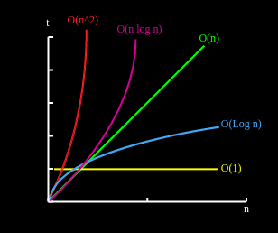

# Big O Observations

[](https://repl.it/github/upperlinecode/<INSERT_GITHUB_EXTENSION>)

## Contents

- [Intro](#intro)
- [The Lab](#the-lab)
- [Extensions](#extensions)
- [Hints & Resources](#hints--resources)

## Intro


## The Lab

> Teacher note: if you went through the Big O lesson with students you can skip to "The Big O of Different Data Structures"

**Big O Speedy Review**

1. Take a look at the code below:
    ```py
    def sum_of(n):
        total_sum = 0
        while n >= 1:
            total_sum += n
            n -= 1
        return total_sum

    sum_of(10)
    ```
    - How many lines of code will likely be run?
    - As n grows, how will the number of run lines change?

2. If the number of lines run is linearly dependent on the data, we can say it has an order of n, or _O(n)_ for short. Take a look at this next piece of code:
    ```py
    def sum_of(n):
        total_sum = n * (n + 1)
        total_sum /= 2
        return total_sum

    sum_of(20)
    ```
    - How many lines of code will likely be run?
    - As n grows, how will the number of run lines change?

3. If the number of lines run is consistent or independent of the data inputted, it has an order of 1, or _O(1)_. 

4. What would your intuition tell you about the following code?
    ```py
    def get_pairs(students):
        pairs = []
        for student1 in students:
            for student2 in students:
                if student1 != student2:
                    pairs.append((student1, student2))
        return pairs

    students = ["Rafael", "Steven", "Manny", "Jeff"]
    print(get_pairs(students))
    ```
    - How many lines of code will likely be run?
    - As n grows, how will the number of run lines change?

5. Notice these 2 ways to code the same search function:
    ```py
    def findA(n, data):
        for idx, value in enumerate(data):
            if n == value:
                return idx
        return -1

    def findB(n, data):
        left = 0
        right = len(data)
        
        while left <= right:
            mid = right // 2

            if n < data[mid]:
                right = mid - 1
            elif n > data[mid]:
                left = mid + 1
            else: # ==
                return mid
            
        return -1
    ```
    - What are the similarities between function `findA` and `findB`?
    - As the size of the _data_ list grows, how will the number of run lines change for each function?
    - [Bonus] What kind of search is `findA` and `findB` doing?

6. You may have noticed that findB is doing a Binary Search. Binary search has a special time complexity of O(log n). Here's what the graph looks like for that. In the graph, `n` is the length of the list, and `t` is the time it take to run the code. 

    


**The Big O of Different Data Structures**

Let's think through some problems and how different solutions can affect the time complexity.

7. Martha is running a **slushy stand** and can think of 3 different ways to save her data for her orders:

    ```py
    # 1
    slushy_orders = {
        'berry': 8, 
        'lemon': 13, 
        'lime': 8, 
        'orange': 9, 
        'raspberry': 12
    }

    # 2
    slushy_orders = ['raspberry', 'lime', 'berry', 'orange', 'lime', 'berry', 'lemon', 'berry', 'lemon', 'berry', 'lemon', 'lemon', 'orange', 'lime', 'lemon', 'lemon', 'lime', 'lemon', 'raspberry', 'lemon', 'raspberry', 'raspberry', 'orange', 'orange', 'orange', 'raspberry', 'raspberry', 'raspberry', 'orange', 'raspberry', 'lemon', 'lemon', 'lemon', 'raspberry', 'raspberry', 'lime', 'lemon', 'orange', 'lemon', 'orange', 'lime', 'orange', 'lime', 'raspberry', 'raspberry', 'berry', 'berry', 'berry', 'lime', 'berry']

    # 3
    slushy_order_types = ['berry', 'lemon', 'lime', 'orange', 'raspberry']
    slushy_orders_counts = [8, 13, 8, 9, 12]
    ```

    - Think of an instance where #1 would be the best data structure to use? ...#2? ...#3?
    - Open the `slushy.py` and complete the challenges. Then as a comment, label each with their time complexity. 


## Extensions

1. Given a list of numbers. How would you find the indexes of the 2 numbers that add up to the largest sum? Take a minute to yourself to think about 2 different solutions. Then, share them with your partner and compare.

2. In the `maxsum.py`, code the solutions that you and your partner came up with in number 1. Then as a comment, label each with their time complexity.

3. [Spicy] I can think of 5 different ways to code number 1. Below are the time complexities. Come up with all 5 ways (or potentially more)!
    - O(n) - (2 different O(n) ways)
    - O(n * log n)
    - O(1) - Hint: there's an exeption here
    - O(n^2)

## Hints & Resources

- 