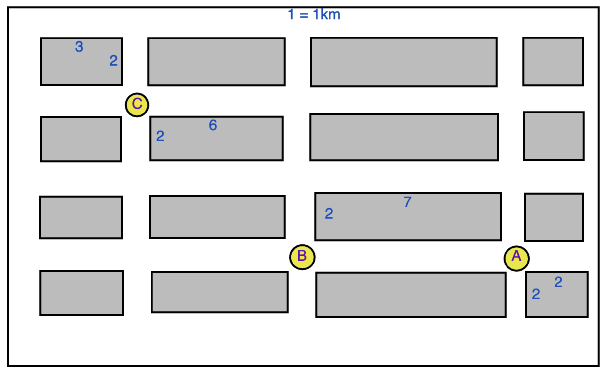
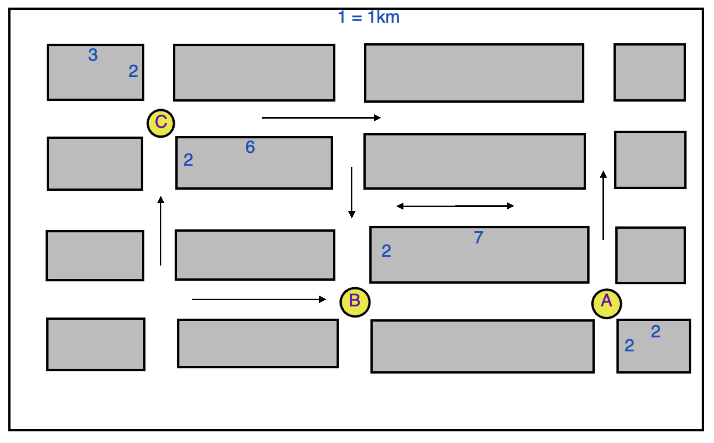
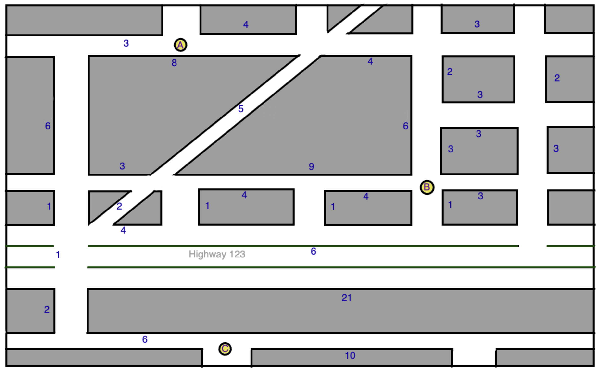

# TITLE

## Teacher Notes

### Goal & Sequence

...

- [Launch](#launch)
- [Lesson Walkthrough](#lesson-walkthrough)
- [Extensions](#extensions)
- [Close](#close)

### Teaching Tips (optional)

### Representation (optional)

### Learning Objectives

Students will be able to:

- Convert two-dimensional arrays to sketched graphs with nodes and edges.
- Use recursion to traverse an array and find available paths.
- Use a `visited list` to detect cycles in an array
- [Stretch] Explore algorithms that optimize traversing and searching.

## Launch

Below is an aerial view section of a city. Each corner will be called a **node** and each street (that connect the corners) will be called an **edge**. _For example, node A is 7km away from node B, because the edge connecting them is 7._

1. How far is node B from node C? _Use **up**, **down**, **left**, and **right** to explain how you go your solution._
2. How far is node A from node C?

You can assume that the streets are 2-way in the above graph. This is called a **bidirectional graph**. What if some of the streets were one way? This would be called **directed graph**.

> Optional: Turn and talk and find all 6 distances with you partner
> 1. A=>B, 2. B=>A, 3. A=>C, 4. C=>A, 5. B=>C, 6. C=>B

1. How far is A to B now?
2. What about B to A?

Look at this different part of the city...

You can probably figure the length of these paths with some time, but maybe you can also realize how this can get very big and complicated very quickly.

- Would you use a linked list or Tree to represent this? What would be the head?

## Lesson Walkthrough

One way to represent this map is using a **graph**. A graph is similar to tree, but there is no head or starting node. Here's an example of a directed graph

- Here's an example of a directed graph: 2d array saying what node you pass to
    - Sketch out the graph on a paper or online draw tool
    - What's one route to get from A to B?
    - Can all be visited?

- Here's an example of a bidirectional graph: 2d array 0s and 1s to show a or no connection
    - Sketch out the graph on a paper or online draw tool
    - What's one route to get from A to B?
    - Can all be visited?

- Here's a weighted bidirectional graph: 2d array 0 and Xs, where X > 0, to show a or no connection
    - Sketch out the graph on a paper or online draw tool
    - What's one route to get from A to B?
    - Whats the fastest?

- Demo of coding can A get to B? (Can be done better with a queue)
    - If array has destination return true
    - else if array is empty return false
    - else - for each element in array
        - if recursive on element with destination is true return true
    - return false

## Extensions (optional)

- Activity: Write code for all these!
- Can all be visited from every node?

## Close (optional)

## Extra Help & Resources

- Dijskras
- BFS
- Finding a cycle

- find any path (no requirement: Optional - BFS and DFS-(pre,in,post-order processing))

Skills
- *Can all be visited?
- Find any path
- *find a cycle (maze algorithm)
- Stretch: Find shortest path (dijskras algorithm, BFS, tricky to intuit but possible)