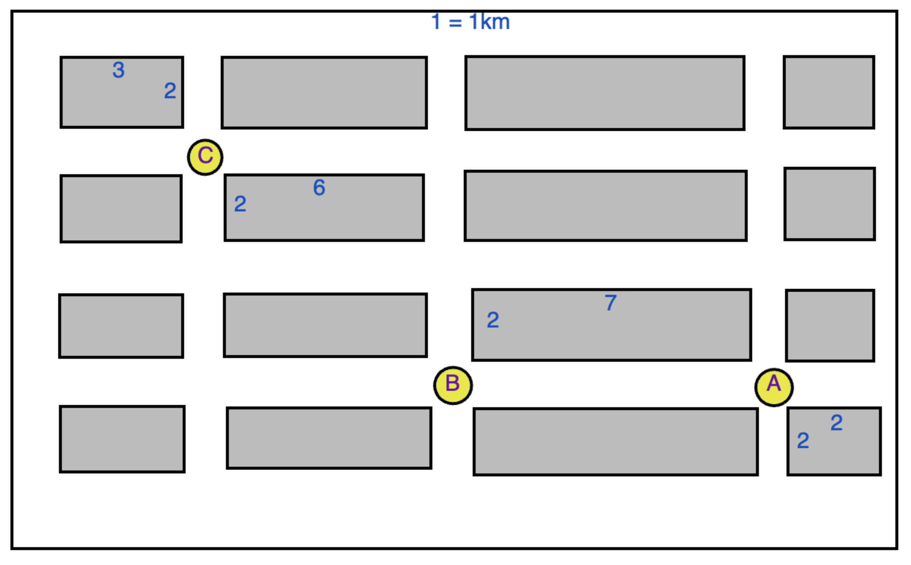
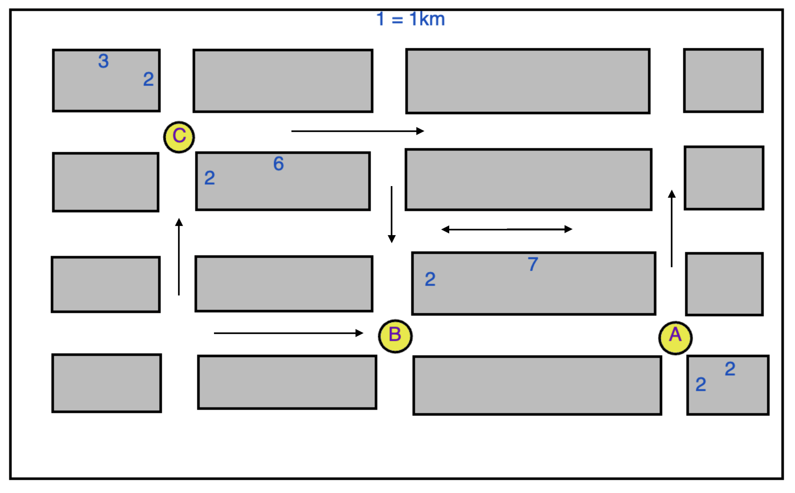

# Intro to Graphs

## Teacher Notes

### Goal & Sequence

This 

- [Launch](#launch)
- [Lesson Walkthrough](#lesson-walkthrough)
- [Extensions](#extensions)
- [Close](#close)

### Teaching Tips (optional)

### Representation (optional)

### Learning Objectives

Students will be able to:

- Convert two-dimensional arrays to sketched graphs with nodes and edges.
- Use recursion to traverse an array and find available paths.
- Use a `visited list` to detect cycles in an array
- [Stretch] Explore algorithms that optimize traversing and searching.

## Launch

Below is an aerial view section of a city. Each corner will be called a **node** and each street (that connect the corners) will be called an **edge**. _For example, node A is 7km away from node B, because the edge connecting them is 7._



1. How far is node B from node C? _Use **up**, **down**, **left**, and **right** to explain how you got your solution._
2. How far is node A from node C?

You can assume that the streets are 2-way in the above graph. This is called a **bidirectional graph**. What if some of the streets were one way? This would be called a **directed graph**.



> Optional: Turn and talk and find all 6 distances with you partner
> 1. A=>B
> 2. B=>A
> 3. A=>C
> 4. C=>A
> 5. B=>C
> 6. C=>B

1. How far is A to B now?
2. What about B to A?

Look at this different part of the city...


You can probably figure the length of these paths with some time, but maybe you can also realize how this can get very big and complicated very quickly.

- Would you use a Linked List or Tree to represent this? What would be the head?

## Lesson Walkthrough

- One way to represent this map is using a **graph**. A graph is similar to tree, but there is no head or starting node. Here's an example of a directed graph:
    ```py
    street_directed_graph = [
        [3],
        [0, 4],
        [1, 5],
        [4],
        [1, 5],
        []
    ]
    # For example: Node-O can get to Node-3
    # Also: Node-1 can get to Node-0 and Node-4
    # NOTE: there are no weights yet!
    ```
    - What nodes can Node-4 get to?
    - Sketch out the graph on a paper or on an online draw tool
    - What's one way to get from 2 to 5? (There's 3!)

- This is an example of a bidirectional graph:
    ```py
    street_bidirectional_graph = [
        [1, 3],
        [0, 2, 4],
        [1, 5],
        [0, 4],
        [1, 3, 5],
        [2, 4]
    ]
    # For example: Node-O can get to Node-3 and 3 back to 0!
    ```
    - Sketch this graph out on a paper or online draw tool
    - What's one route to get from 2 to 5 without repeating nodes?

- Finally, this is a _weighted graph_ in a different format: 
    ```py

    street_weighted_graph = [
        [0, 0, 0, 2, 0, 0],
        [6, 0, 0, 0, 3, 0],
        [0, 2, 0, 0, 0, 9],
        [0, 0, 0, 0, 1, 0],
        [0, 3, 0, 0, 0, 2],
        [0, 0, 0, 0, 0, 0]
    ]

    # For example: Node-O can get to Node-3 with a cost of 2!
    # 0 means cannot go to that node
    ```
    - Sketch out the graph on a paper or an online draw tool
    - What's one route to get from 2 to 5? (There are 3)
    - What's the total cost to get from 2 to 5?
    - Which route has the cheapest cost?

- Let's look at how to code this. "Can we get from A to B?" What might the base case be?
    ```py
    def is_connected(graph, current, destination):
        #Base Case

        #Recursive Case

        return False

    # Can node 0 get to 5?
    print(is_connected(street_weighted_graph, 0, 5))
    # Can node 3 get to 2?
    print(is_connected(street_weighted_graph, 3, 2))
    ```

    **Pseudo Code** for `is_connected()`

    1. (Base Case) If current node's list has the destination node, return True
    2. Otherwise, for each element in list...
        - Recurse on the element; If it returns True, return True.
    3. If you made it this far without returning True, return False

    ```py
    def is_connected(graph, current, destination):
        #Base Case
        if destination in graph[current]:
            return True

        #Recursive Case
        else:
            for next_node in graph[current]:
                if is_connected(graph, next_node, destination):
                    return True

        return False

    print(is_connected(street_weighted_graph, 0, 5))
    print(is_connected(street_weighted_graph, 3, 2))
    ```

- Turn and talk to your partner and trace this program out loud with them.

## Extensions (Optional)

1. Using the `street_directed_graph` in the first example, write a function that will check if there's a path from 1 node to another. _Be sure to test your function._

2. Using the `street_bidirectional_graph` in the second example, write a function that will check if there's a path from 1 node to another **without visiting the same node twice**. _Hint: Create a `visited` list that gets updated and passed through the recursion._

3. Using the `street_directed_graph` in the first example, write a function that will print **all** the possible paths from 1 node to another.

4. Using the `street_weighted_graph` in the third example, write a function that will print **all** the possible paths from 1 node to another.

5. Can every node be visited from every node? Use any graph you prefer to build a function that checks if you can get from any node to any other node.

6. Using the `street_weighted_graph` in the third example, write a function that will find all the paths from one node to another, and the total of each path. You output should look as follows.

    ```py
    weighted_path(street_weighted_graph, 2, 5)
    #Output###
    [
        {'path':[2, 5], 'cost':6},
        {'path':[2, 1, 4, 5], 'cost':10}
    ]
    ####

    weighted_path(street_weighted_graph, 3, 2)
    #Output###
    []   # ..because there is no path from 3 to 2
    ####
    ```

7. Turn the image below into a weighted graph. Then, test with #4 and #6.


## Extra Help & Resources
