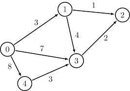

# Graphs: Cycles and Mazes

[](https://repl.it/github/upperlinecode/<INSERT_GITHUB_EXTENSION>)

## Contents

- [Intro](#intro)
- [The Lab](#the-lab)
- [Extensions](#extensions)
- [Hints & Resources](#hints--resources)

## Intro

If you ever have the positive and negative of a charge touch, you can start a fire. The flow of energy, as in a power plant, should never loop back onto itself. 

In this lab, you're given the plans of several power grids. There are a couple of rules we should be looking for to ensure a healthy grid.

1. Can all power plants in the grid receive power? (Good)
2. Are there any cycles or loops of power? (Bad)

Some additional concerns are:

3. Can we find the path from the main power source to any other power plant?
4. Stretch: Is there an optimal cost of power transfer?

## The Lab

You're given a list of lists. Each index represents a power plant node, and the list of values at that index represent any nodes that that plant sends power to. For example
```py
power_grid = [
    [1],
    [3],
    [1],
    [0, 2],
    [1, 3, 5],
    [0]
]

# Powerplant-0 sends power to 1
# Who does Powerplant-3 send power to?
# Which plant doesn't receive any power? (This is the main plant)
```

1. Sketch a directed graph to see how the plants are powering each other in the grid.
2. Do all the plants in the grid get power? Use your sketch.
3. Are there any cycles (loops of power)? Use your sketch.

**Walkthrough**

From Powerplant-4, can we get to Powerplant-0?

> Have students try this on their own before going over one way to do this.

1.  Write a recursive function that starts at `starting_plant` and ends at `destination_plant`. First, we need the base case:
    ```py
    def is_found(power_grid, current_plant, dest_plant):
        if dest_plant in power_grid[current_plant]:
            return True
        #...
    ```

2. If the `destination_plant` is not immediately found, recursively check each connected plant:
    ```py
    def is_found(power_grid, current_plant, dest_plant):
        if dest_plant in power_grid[current_plant]:
            return True
        else:
            for connected_plant in power_grid[current_plant]:
                if is_found(power_grid, connected_plant, dest_plant):
                    return True
            
        return False
    ```

3. This should work, but what happens if there's a cycle? To resolve this, we should keep track of the nodes (`power_plants`) we already visited, and skip over them:
    ```py
    def is_found(power_grid, current_plant, dest_plant, visited_plants=[]):
        if dest_plant in power_grid[current_plant]:
            return True
        else:
            visited_plants.append(current_plant)
            for connected_plant in power_grid[current_plant]:
                if connected_plant not in visited_plants and is_found(power_grid, connected_plant, dest_plant, visited_plants):
                    return True
            
        return False

    starting_plant = 4
    destination_plant = 0
    print(is_found(power_grid, starting_plant, destination_plant))
    ```

## Extensions

_See `main.py` for the extensions_


**For extension #4 and #5:**

A weighted graph is a graph whose edges have a "cost" of some kind.

- It costs 3 units to get from node-0 to node-1. In this case, these nodes represent power plants, and the cost on the edges represent the money in dollars to send 10 kilowatts of power (It costs $3 to send 10kw from plant-0 to plant-1).
- This is how the graph above will be represented in python code:
    ```py
    weighted_power_grid = [
        [0, 3, 0, 7, 8],
        [0, 0, 1, 4, 0],
        [0, 0, 0, 0, 0],
        [0, 0, 2, 0, 0],
        [0, 0, 0, 3, 0]
    ]
    ```
    - `(0, 1)` has `3`, because of the cost aforementioned.
    - A `0` in the graph means there is no connection

## Hints & Resources

- Hitting every node (traversing) through a graph
- A video on looking for cycles
- [Spicy] Finding the shortest path (Dijsktra's Algorithm)