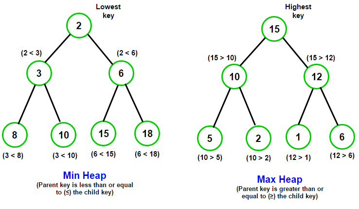

# Heaps: Building up to Heap Sort

[](https://repl.it/github/upperlinecode/<INSERT_GITHUB_EXTENSION>)

## Contents

- [Intro](#intro)
- [The Lab](#the-lab)
- [Extensions](#extensions)
- [Hints & Resources](#hints--resources)

## Intro

Heaps are a type of tree that is stored not in a dictionary, not using object oriented programming, but using lists. Typically a heap is either a "Min Heap" or a "Max Heap" making it good for sorting and prioritization.

## The Lab

**Introduction to Heaps**

The Tree data structure is a concept that can take different forms. Take a look at these 2 applications.

- In the Tree lesson, you may remember seeing a tree structure shown as a dictionary similar to this one.
    ```py
    # Example 1
    head = {
        "value":9,
        "left":{
            "value":5,
            "left":{
                "value":1,
                "left":None,
                "right":None
            },
            "right":{
                "value":3,
                "left":None,
                "right":None
            },
        },
        "right":{
            "value":4,
            "left":{
                "value":2,
                "left":None,
                "right":None
            },
            "right":None
        }
    }

    # Output
    print(head['left']['right']['value'])
    ```
    - How many **leaf nodes** are in the tree?
    - What is the value of the **head** of the tree?
    - What is the predicted output?

- Here's a visual of what it would look like when graphed. Notice how in this graph, all the parent nodes are greater than both of their children nodes.
    

- Take a look at this interpretation of the same tree structure.
    ```py
    # Example 2
    max_heap = [9, 5, 4, 1, 3, 2]

    def head_idx():
        return 0

    def left_of(idx):
        return 2*idx + 1

    def right_of(idx):
        return 2*idx + 2

    def parent_of(idx):
        return (idx-1) // 2     # eg. 3 // 2 = 1

    # Outputs
    head_value = tree2[head_idx()]
    print(head_value)

    node_idx = right_of(left_of(head_idx()))
    node_value = tree2[node_idx]
    print(node_value)
    ```
    Turn and talk to your partner
    - What is the head node's value?
    - What are the predicted outputs here?
    - Take a second to validate that this example produces the same output from above. What is easier and harder about storing tree values this way?

## Extensions

_Note: These same challenges can be found in the `heapify.py`. Come here for more details, explanations, and hints._

Heaps are created with the intent of being a tree that has either the greatest value at the head/key (as in a Max Heap) or the least value at the head/key (as in a Min Heap). Notice the pattern is consistent between Parent nodes and their Children nodes:



**Adding a Value**

1. Adding to a heap means putting the new value at the head and then "heapify"-ing it down to its proper position. Here are the 2 steps:
    - Add the new value to the head; aka the beginning of the list.
    - (**Heapify**) while the inputted value is greater than either of the two children, swap with the smaller of the 2.

    
    ```py
    # 1. Finish the code by writing the min_heapify function
    min_heap = [2, 3, 6, 8, 10, 15, 18]

    def min_heapify(heap):
        # Your code here

    def push(value, heap):
        heap = [value] + heap
        min_heapify(heap)

    push(9, min_heap)
    print(min_heap)      # [2, 6, 3, 9, 8, 10, 15, 18]

    ```
    _Hint: First, try these steps with your partner on a pencil and paper or on a digital app. Add the number 9, follow the steps, and watch it float down to its proper spot._

**Removing a value**

2. Removing (or popping) from a heap means taking out the head. Here are the steps:
    - Swap the first and last element in the list (aka the head and the last leaf node)
    - Remove the last element from the list, and return it.
    - Heapify the resulting list (because now the first element would be out of place)

    ```py
    # 2. Finish the code and pop the head out of the list. Use your min_heapify function from before.

    min_heap = [2, 3, 6, 8, 10, 15, 18]

    def pop_min_heap(heap):
        # your code here
        return value

    print("Minimum Value:", pop_min_heap(min_heap))  # 2
    print(min_heap)         # [3, 6, 10, 9, 8, 18, 15]

    ```

**Finding the leaf nodes**

3. A leaf node is a node that has no children nodes. Write a function that returns the indexes of all the leaf nodes in a heap. _Hint: it should be a list of consecutive values_

**Making a Heap with an unsorted Tree**

4. Write a function `max_heapify(heap)` that does the same as `min_heapify(heap)`, but keeps the greatest value at the head.

5. The heap below is currently not a **Max Heap** as it should be (it's just an unsorted tree). Write a function `build_max(heap)` that turns a list into a max heap. Here are the steps:
    - Find all the leaf nodes
    - For each parent node, going backwards, max_heapify it.
    ```py
    data = [13, 17, 1, 5, 4, 9, 14, 10, 6]

    def build_max(heap):
        pass

    max_heap = build_max(data)
    print(max_heap)
    ```

**Heap Sort**

6. Put it all together! Given a list of unsorted values, write a function `heap_sort(data)` that sorts the values from least to greatest. Here are the steps
    - Turn the list into a min_heap
    - "Pop" the minimum value (the head) into a new list until there are no values left. (remember to min_heapify after each pop)
    - Return the new sorted list.


## Hints & Resources

- Video Resources
    - [What is a Heap](https://www.youtube.com/watch?v=0wPlzMU-k00)
    - [Building a Heap](https://www.youtube.com/watch?v=pAU21g-jBiE)
    - [Heap Sort](https://www.youtube.com/watch?v=2DmK_H7IdTo)