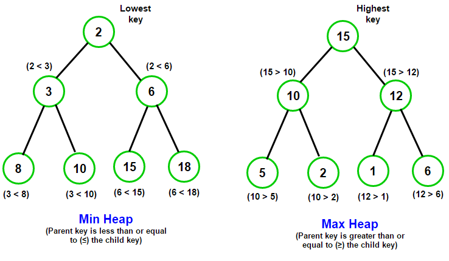

# Heaps: Building up to Heap Sort

[](https://repl.it/github/upperlinecode/<INSERT_GITHUB_EXTENSION>)

## Contents

- [Intro](#intro)
- [The Lab](#the-lab)
- [Extensions](#extensions)
- [Hints & Resources](#hints--resources)

## Intro

Heaps are a type of tree that is stored not in a dictionary, not using object oriented programming, but using lists. Typically a heap is either a "Min Heap" or a "Max Heap" making it good for sorting and prioritization.

## The Lab

**Introduction to Heaps**

- The Tree data structure is a concept that can take different forms. Here's a visual of a tree. Notice how all the parent nodes are greater than both of their children nodes.
    

    - How many **leaf nodes** are in the tree?
    - What is the value of the **head** of the tree?

- (Optional) In the Trees lesson, you may remember seeing a tree structure shown as a dictionary similar to this one:
    ```py
    # Example 1
    head = {
        "value":9,
        "left":{
            "value":5,
            "left":{
                "value":1,
                "left":None,
                "right":None
            },
            "right":{
                "value":3,
                "left":None,
                "right":None
            },
        },
        "right":{
            "value":4,
            "left":{
                "value":2,
                "left":None,
                "right":None
            },
            "right":None
        }
    }

    # Output
    print(head['left']['right']['value'])
    ```
    - What is the predicted output?


- Take a look at this interpretation of the same tree structure.
    ```py
    # Example 2
    max_heap = [9, 5, 4, 1, 3, 2]

    def head_idx():
        return 0

    def left_of(idx):
        return 2*idx + 1

    def right_of(idx):
        return 2*idx + 2

    def parent_of(idx):
        return (idx-1) // 2     # eg. 3 // 2 = 1

    # Output 1
    head_value = tree2[head_idx()]
    print(head_value)

    # Output 2
    node_idx = right_of(left_of(head_idx()))
    node_value = tree2[node_idx]
    print(node_value)
    ```
    Turn and talk to your partner
    - What is the head node's value?
    - Sketch the graph of this tree.
    - What are the predicted outputs here?
    - (Optional) Take a second to validate that this example produces the same output from above.
    - What is easier and harder about storing tree values this way?

## Extensions

_See `main.py` for the extensions._

_Come here for hints and additional support_

Heaps are a tree that has either the greatest value at the head/key (as in a Max Heap) or the least value at the head/key (as in a Min Heap). Notice the pattern between Parent nodes and their 2 Children nodes:



**Push - Insert into a heap**

When adding a value to a Heap, always insert it at index 0.

Then, **"heapify"** the heap! In other words, move the new value to its correct spot. Here are the 2 steps:
- Add the new value to the head; aka the beginning of the list.
- **Heapify** - While the inputted value is greater than either of its 2 children, swap it with the smaller of the 2 children.
```
# For example

min_heap = [4, 6, 10] # perfectly good min heap

# insert at beginning
new_value = 11
min_heap = [11, 4, 6, 10] # not min heapified; 11(parent) > 4(child) AND > 6 (other child)

# heapify
# swap 11 with 4 because 4 is smaller child
[11, 4, 6, 10] => [4, 11, 6, 10]
# Now 11(parent) > 10(only child) so swap again.
[4, 11, 6, 10] => [4, 10, 6, 11]
# 11 has no more children, done!

[4, 10, 6, 11] # heapified again!
```

**Pop - Remove value from heap**

Removing (or popping) from a heap means taking out the head. Here are the steps:
- Swap the first and last element in the list (aka the head and the last leaf node)
- Remove the new last element from the list, and return it.
- Heapify the resulting list (because now the first element would be out of place)
```
# For example

min_heap = [4, 10, 6, 11]

#1. swap first and last
[4, 10, 6, 11] => [11, 10, 6, 4]

#2. remove/return the new last element (which is the smallest)
4
[11, 10, 6]

#3. min-Heapify
# 11 > 10 and 11 > 6 (6 is smaller so swap)
[11, 10, 6] => [6, 10, 11]
# 11 has no children, done!

new_min_heap = [6, 10, 11]
```

**Finding the leaf nodes**

A leaf node is a node that has no children nodes. _Hint: it should be a list of consecutive values_

```
[2, 3, 5, 8, 10, 11, 14, 17, 18, 21]

# Does 2 have a left child? (yes, 3) Not a leaf node...
# Does 3 have a left child? (yes, 8) Note a leaf node..
# ...
# Does 10 have a left child? (yes, 21) Note a leaf node..
# Does 11 have a left child? (no) 1st leaf node!

# 11 to the end are leaf nodes.
leaf_node_indexes = [5, 6, 7, 8, 9]
```

**Making a Heap from scratch! (With an unsorted Tree)**

Here are the steps for turning an unsorted tree into a max heap:
- Find all the leaf nodes. (We can assume they are in right place for now)
- For each parent node, going backwards, max_heapify them.

**Heap Sort**

You may recall doing sorting algorithms like Insertion and Selection Sort. Here are the steps for Heap Sort:
- Turn the list into a min_heap (if sorting from least to greatest)
- In a loop, "Pop" the minimum value (the head) into a new list until there are no values left. (remember to min_heapify after each pop)
- Return the new sorted list.


## Hints & Resources

- Video Resources
    - [What is a Heap](https://www.youtube.com/watch?v=0wPlzMU-k00)
    - [Building a Heap](https://www.youtube.com/watch?v=pAU21g-jBiE)
    - [Heap Sort](https://www.youtube.com/watch?v=2DmK_H7IdTo)