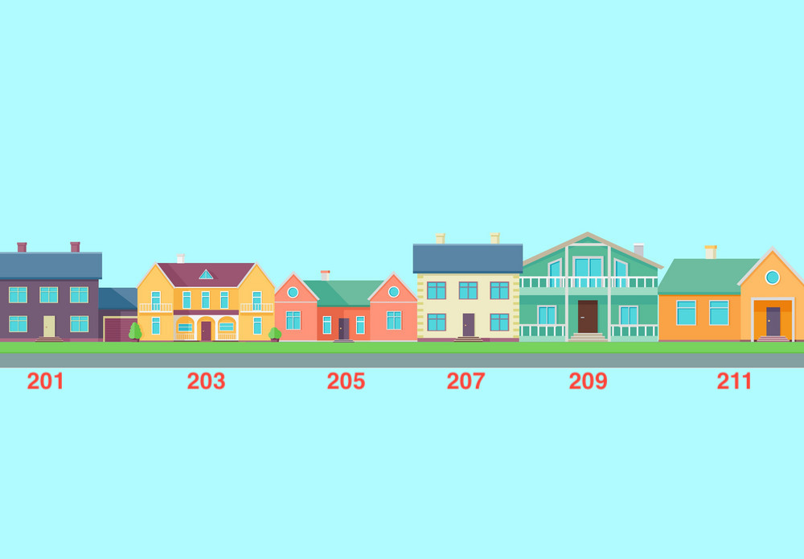
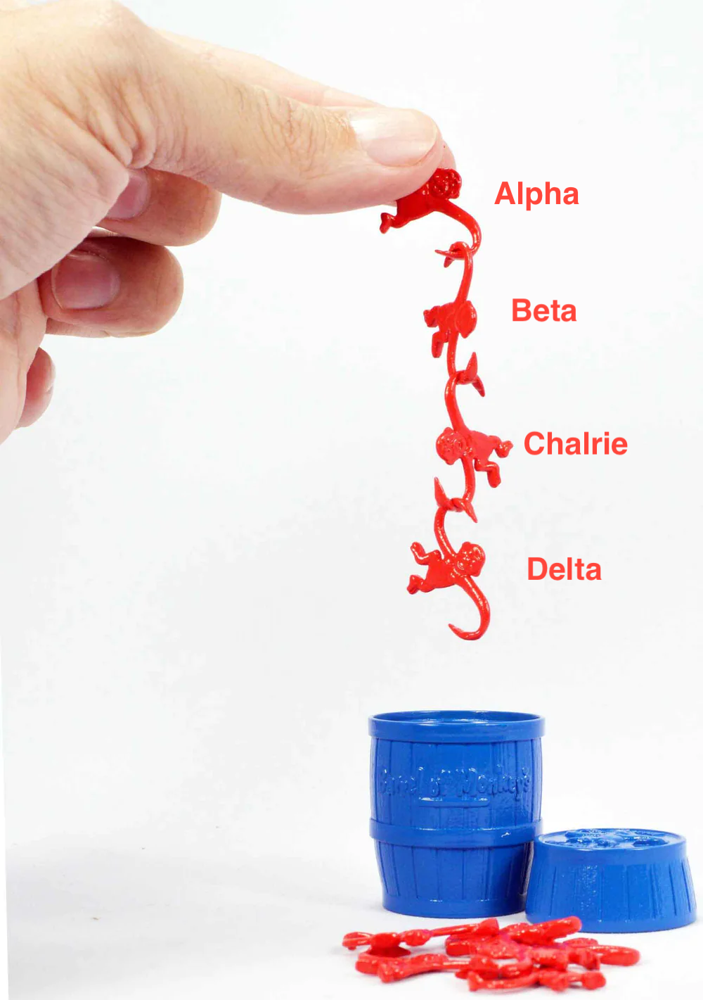

# Linked Lists: Barrel of Monkeys

[](https://repl.it/github/upperlinecode/<INSERT_GITHUB_EXTENSION>)

## Teacher Notes

### Goal & Sequence

...

- [Launch](#launch)
- [Lesson Walkthrough](#lesson-walkthrough)
- [Extensions](#extensions)
- [Close](#close)

### Teaching Tips (optional)


### Representation (optional)

### Learning Objectives

Students will be able to:

_with advanced lense_
_3-5 objectives_
_0-2 stretch obj._

## Launch

- When you have a list, you have a data structure that has a fixed length and a specific index for each value. This is most similar to houses on a street block with given addresses. 

    

    1. What are some other examples of this structure in real life?
    2. How would you imagine removing or adding a house?
    3. If you eliminate the house at 205, what would you consider to be the 3rd house?

- When you have a linked list, you have a chain of responsibility. A variable is holding 1 value, the first value. That first value is holding the next value, which is holding the next, etc. like a spotify playlist or this barrel of monkeys.

    

- Thinking about this barrel of monkeys used to represent a linked list, answer the following questions:

    1. Who is the hand responsible for?
    2. Who is Charlie holding?
    3. If the hand switches to holding "Beta", what would happen to "Alpha"? "Charlie"?
    4. [Spicy] Without flipping any monkeys upside down or putting any of them on the table, how would you add a monkey between say Beta and Charlie?
    5. [Spicy] Without flipping any monkeys upside down or putting any of them on the table, how would you remove a monkey like Charlie?
    6. [Stretch] Without flipping any monkeys upside down or putting any of them on the table, how would you reverse the link so that "Delta" is held by the hand, and "Alpha" is at the bottom being held by "Beta"? 

## Lesson Walkthrough

1. Each element in a linked list is called a "**node**", and each node has 2 things at minimum: the **data** and the **next** node it's holding in the link. The **head** is the variable that holds the first value.


2. What would you assume is the representation of this vocabulary -- node, next, head, and null -- using the chain of monkeys example?

3. Let's look at a couple of examples of code to illustrate this. (NOTE: this is not how linked lists are actually implemented, but still carries the same concept)

    ```py
    first_monkey = "Alpha"
    monkeys = {
        "Alpha": "Beta",
        "Charlie": "Delta",
        "Delta": None,
        "Beta": "Charlie"
    }
    ```

4. Notice this dictionary and how the same vocabulary can apply. A key/value pair is a node, the key is the data, the value is the next property, and the head is a separate variable.

5. Open the `linked_list.py` and complete the challenges with your partner.

## Extra Help & Resources

- 