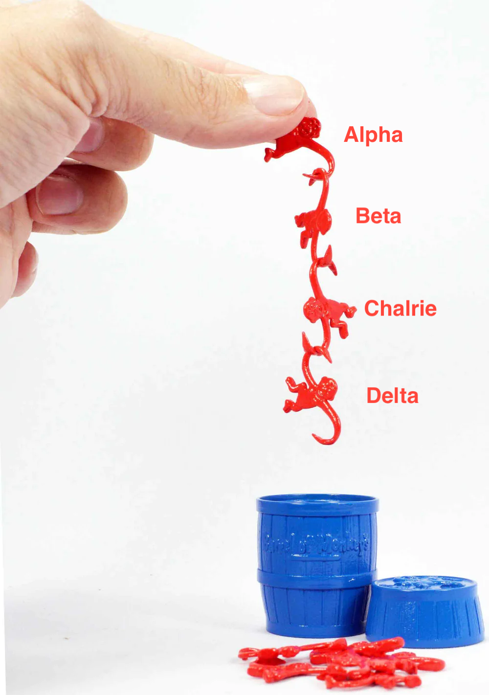

# Linked Lists: Barrel of Monkeys

## Teacher Notes

### Goal & Sequence

This lesson is a chance for students to get familiar with linked lists without getting in the weeds of coding. It is designed to be mostly a discussion and a thought activity.

Later on, a dictionary is used to conceptualize a linked list. Though this is not the way it is typically coded, we find this is helpful for students to grasp the concept of a chain or linked list.

- [Launch](#launch)
- [Lesson Walkthrough](#lesson-walkthrough)
- [Extensions](#extensions)
- [Close](#close)

### Learning Objectives

Students will be able to:

- Compare and contrast linked lists with Python lists (arrays)
- Discuss algorithms for removing items from linked lists and reversing a linked list
- [Stretch] Experiment with linked-list-like code using a dictionary mapping.

## Launch

- When you have a list, you have a data structure that has a fixed length and a specific index for each value. This is most similar to houses on a street block with given addresses. 

    

    1. What are some other examples of this structure in real life?
    2. How would you imagine removing or adding a house?
    3. If you eliminate the house at 205, what would you consider to be the 3rd house?

- When you have a linked list, you have a chain of responsibility. A variable is holding 1 value, the first value. That first value is holding the next value, which is holding the next, etc. like a spotify playlist or this barrel of monkeys.

    

- Thinking about this barrel of monkeys used to represent a linked list, answer the following questions:

    1. Who is the hand responsible for?
    2. Who is Charlie holding?
    3. If the hand switches to holding "Beta", what would happen to "Alpha"? "Charlie"?
    4. [Spicy] Without flipping any monkeys upside down or putting any of them on the table, how would you add a monkey between say Beta and Charlie?
    5. [Spicy] Without flipping any monkeys upside down or putting any of them on the table, how would you remove a monkey like Charlie?
    6. [Stretch] Without flipping any monkeys upside down or putting any of them on the table, how would you reverse the link so that "Delta" is held by the hand, and "Alpha" is at the bottom being held by "Beta"? 

## Lesson Walkthrough

1. Each element in a linked list is called a "**node**", and each node has 2 things at minimum: the **data** and the **next** node it's holding in the link. The **head** is the variable that holds the first value.


2. What would you assume is the representation of this vocabulary -- node, next, head, and null -- using the chain of monkeys example?

3. Let's look at a couple of examples of code to illustrate this. (NOTE: this is not how linked lists are actually implemented, but still carries the same concept)

    ```py
    first_monkey = "Alpha"
    monkeys = {
        "Alpha": "Beta",
        "Charlie": "Delta",
        "Delta": None,
        "Beta": "Charlie"
    }
    ```

4. Notice this dictionary and how the same vocabulary can apply. A key/value pair is a node, the key is the data, the value is the next property, and the head is a separate variable.

5. Open the `linked_list.py` and complete the challenges with your partner.

## Extra Help & Resources