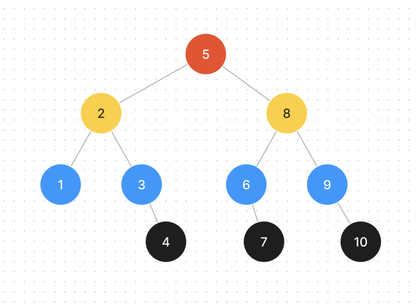
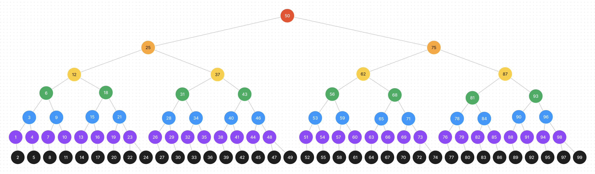

# Binary Search Trees

[](https://repl.it/github/upperlinecode/<INSERT_GITHUB_EXTENSION>)

## Teacher Notes

### Goal & Sequence

The goals is to use visuals and dictionaries to conceptualize Trees. The second half of the lesson can be skipped, but is encouraged if your students need more help with object oriented programming.

The concept of a node having 2 or more children nodes is defining of a tree structure, but this lesson is limited to 1-2 children nodes for simplicity. In the lab, the idea of using more than 2 children nodes is explored. 

- [Launch](#launch)
- [Lesson Walkthrough](#lesson-walkthrough)
- [Extensions](#extensions)
- [Close](#close)

### Teaching Tips

The optional challenge is good if your students are craving a little bit more, but can put students who are struggling to understand in the panic zone. If this is a worry with your students, consider switching to the lab instead.

### Learning Objectives

Students will be able to:

- Visually navigate a Tree data structure.
- Read and write functions that iterate through a tree.
- 

## Launch

When we learned Binary search, we saw the concept of cutting numbers in half to more quickly find the number being searched for. Think of the higher lower game. Now, look at this visual for guessing a number between 1 and 10.



1. What is common between every circle, "node", in this diagram?
2. This diagram is called a "Tree" and typically is read from the top down. How many nodes do you travel to before arriving at 9? 
3. What is the least and most nodes you will ever have to travel through?



- Answer question 2 and 3 above with this diagram of numbers 1-100!


## Lesson Walkthrough

- A tree is just a concept that is usually applied using Object Oriented Programming, but we can use a dictionary to illustrate the same thing.
    ```py
    tree = {
        "value": 5,
        "left": {
            "value":2,
            "left":{
                "value":1,
                "left":None,
                "right":None
            },
            "right":{
                "value":3,
                "left":None,
                "right":{
                    "value":4,
                    "left":None,
                    "right":None
                }
            }
        },
        "right": {
            "value":8,
            "left":{
                "value":6,
                "left":None,
                "right":{
                    "value":7,
                    "left":None,
                    "right":None
                }
            },
            "right":{
                "value":9,
                "left":None,
                "right":{
                    "value":10,
                    "left":None,
                    "right":None
                }
            }
        }
    }
    ```
    - In the code snippet above, how many attributes does `tree` have?
    - What are the values that have none for both their left and right child node?
    - Which parent nodes have both their left and right child?

- There are several layers of nesting happening here. Here's an example of working through the tree above. Answer the questions below before running the code in `main.py`.
    ```py
    def get_value(t):
        current_node = t
        while current_node['right']:
            current_node = current_node['right']
        return current_node['value']

    print(get_value(tree))
    ```
    - What do you predict to be the output of this code snippet?
    - What would be a better, more descriptive name for this function?
    - What would happen if `'right'` was changed to `'left'` both times?

## Extensions

Try the challenges in `main.py` before the optional challenge below!

---

**Optional Challenge**

When trees are made with special rules in mind, complex problems become much easier to solve. This is similar to the tree above, but it's called a "Red Black Tree".


- A leaf node is any circle that has no children. How many black nodes are passed through to get to each leaf node?
- Where would the number 16 go? What color would it be?
- What other patterns do you notice about this particular red/ black tree?
- [Spicy] If no parent and child node can both be red, where would 9 have to go and what colors would have to change? Use a pencil and paper or digital drawing app to illustrate.

## Close

- How do trees make searching for values easier? ...more challenging?
- If a tree used significantly less "_lefts_" than it did "_rights_", how would this change it's benefits? (Bonus) What data structure would this be closer to?
- What was the most challenging part of this lesson?

## Extra Help & Resources

- [Red Black Trees](https://www.geeksforgeeks.org/introduction-to-red-black-tree/)