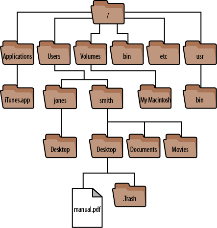

# Object Oriented Trees: Files & Folders

[](https://repl.it/github/upperlinecode/<INSERT_GITHUB_EXTENSION>)

## Contents

- [Intro](#intro)
- [The Lab](#the-lab)
- [Extensions](#extensions)
- [Hints & Resources](#hints--resources)

## Intro

Sally Sanchez was a splendid secretary. The big boss has a ton of files that Sally organized and they made a program to remember the file structure. It looks something like this (but these aren't the exact files).



Sally fortunately moved on to a better job, and you are now taking their place.

## The Lab

Open the `main.py`. This is where you will be writing all of your code. The `boss_files.py` is what Sally was working on before they left. Below is some support on challenge 1 and 3 if needed. If not, feel free to skip straight to the challenges in the `main.py`.

- The tree Sally made is created using Object Oriented Programming (OOP). And the files are saved in a variable called `home`. This is what a bit of it looks like:
    

- The whole file structure isn't finished, but this is the structure of each node (folder).
    ```py
    # The structure of a folder
    class Folder():
        def __init__(self, name):
            self.name = name    # name of this folder
            self.folders = []   # list of children node folders
            self.files = []     # strings of file names

    # Outputs
    print(home)
    print(home.name)
    print(home.folders)
    print(home.files)
    ```
    
    - According to the graph above, try to predict what will print before running this code yourself.
    - Notice what works and doesn't work as expected. Why do you think the output is inconsistent?

- Because the folders are in a list, we can still use len() to count them. The strings `<__main__.Folder object at 0x7fc900ef9570>` aren't the folder names, they are the computer's label for a node object. If we save this in a variable, we can call `name`, `folders`, and `files` on it like we did with home.
    ```py
    print("Folder names:")
    for folder in home.folders:
        print("-", folder.name)


    print(len(home.folders), "folders in the Home folder")
    ```
    - What will the last print statement print?
    - In the for loop, what is saved in folder?
    - What do you predict the first 3 lines will do?

## Extensions

_See the `main.py` for the challenges_

## Hints & Resources

- [Notes on OOP](https://www.w3schools.com/python/python_classes.asp)
- Looking for more? Check out this [video on m-way trees](https://www.youtube.com/watch?v=6mbAg7Y906U).