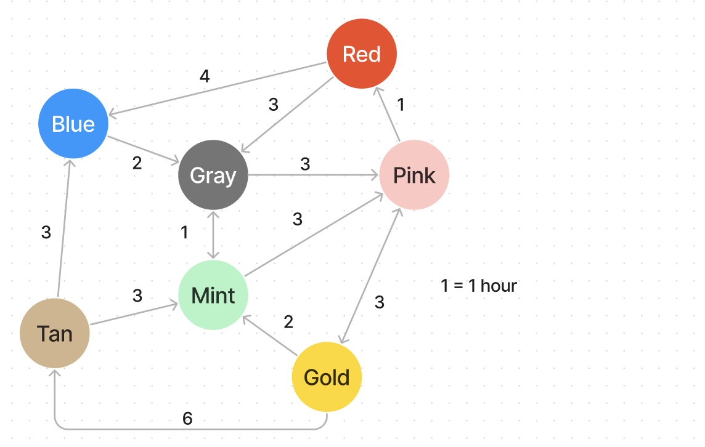

# Airport Network Graph

[](https://repl.it/github/upperlinecode/<INSERT_GITHUB_EXTENSION>)

## Contents

- [Intro](#intro)
- [The Lab](#the-lab)
- [Extensions](#extensions)
- [Hints & Resources](#hints--resources)

## Intro

Graphs can be used for all kinds of things like internet network connections, file structures, solving mazes, genetic trees and other tree diagrams, airport and other transportation systems, and so much more. Today we look at weighted graphs that represent travel time from station to station in a transportation network.

## The Lab

**Colóur Airport**

- In the extensions you will be looking at a much bigger network, but for now, we look at this small transportation network of planes.

    

    - What's one way to get from `Gold` to `Blue`? How many ways can you find?
    - How long in hours will it take? Which is the quickest and slowest way (without repeating stations)?
    - What was your approach in finding the quickest path? Can you explain it as a step-by-step algorithm?

- Here's what they `color_airport` looks like in code. We can use a dictionary to show the connections:
    ```py
    color_airport = {
        'red' :{'blue':4, 'gray':3  },
        'blue':{'gray':2  },
        'gray':{'pink':3, 'mint':1  },
        'pink':{'red' :1, 'gold':3  },
        'mint':{'pink':3, 'gray':1  },
        'gold':{'pink':3, 'mint':2, 'tan':6},
        'tan' :{'blue':3, 'mint':3  },
    }

    print(color_airport['gold']['mint'])
    print(color_airport['mint']['gold'])

    print(color_airport.keys())
    print(color_airport['gold'].keys())
    ```
    - What do you predict these outputs will be?

## Extensions

Write the functions for the following challenges in the `main.py`.

Mild

- Can `gold` get to all nodes? Write a function that checks if a you can get to all the nodes from any given node.

- 

## Hints & Resources